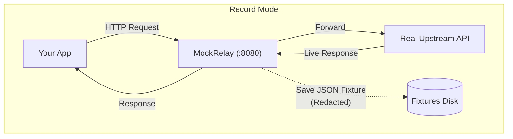
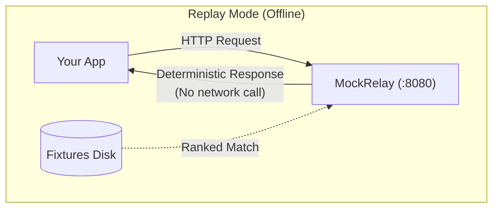

# MockRelay

<p align="center">
  
</p>

<p align="center">
  <a href="https://github.com/sswivell/mock-relay/actions/workflows/ci.yml"></a>
  <a href="https://sswivell.github.io/mock-relay/"></a>
  
  
  <a href="LICENSE"></a>
</p>

<p align="center">
  <b>Record a real API once. Replay it locally whenever you want.</b>
</p>

---

## What is MockRelay?

MockRelay is a local HTTP proxy for recording real API traffic and replaying it from deterministic fixtures.

Instead of writing and maintaining handcrafted mock servers or depending on flaky third-party sandboxes during development, you point your application at MockRelay.

- In **record mode**, MockRelay proxies requests upstream to real services (like Stripe, GitHub, or internal microservices) and saves each request/response pair as a clean, redacted JSON fixture on disk.
- In **replay mode**, MockRelay serves those recorded responses completely offline and deterministically — no live network calls, no rate limits, and no sandbox outages.

## Why use it?

- **Frontend & mobile development:** Build against stable, realistic backend responses without having to run full backend stacks or wait for unreleased APIs.
- **Integration testing & CI:** Run test suites offline in CI quickly and reliably without burning through third-party API rate limits.
- **Offline development:** Keep developing on planes, trains, or during ISP outages with fully functional local replicas of external APIs.
- **Reproducing tricky API responses:** Capture specific edge cases, error states (e.g. `429`, `500`), or latency spikes and replay them on demand.
- **Deterministic development:** Fixtures are stored as plain JSON files in `./fixtures/<upstream>/`. Commit them to git alongside your test suite for reproducible behavior across teams.
- **Zero unnecessary live API calls:** Avoid consuming third-party API quotas, test account costs, or triggering unwanted side effects on real servers.
- **Safe version control:** Request and response headers and bodies pass through an automated redaction pipeline. Sensitive tokens, credentials, and API keys are stored as `{{SECRET}}`.
- **Ranked smart matching:** Candidates are ranked by specificity (`exact` > `wildcard` > `regex` > `fuzzy`) so `/users/42` always beats `/users/*`, regardless of file order on disk.

---

## Core Concept





---

## Quickstart

### 1. Install

Requires Python 3.10+ and has a single runtime dependency (PyYAML):

```bash
pip install "mockrelay @ git+https://github.com/sswivell/mock-relay.git"
```

This installs the CLI as `mockrelay`. If you prefer a local checkout:

```bash
git clone https://github.com/sswivell/mock-relay.git
cd mock-relay
pip install -e .
```

> **Note on PyPI:** MockRelay is not published on PyPI yet. The install command
> above is the supported one and resolves the same tagged source the release
> workflow builds. Once a release is published, `pip install mockrelay` will
> work unchanged.

### 2. Initialize configuration

Generate a default `mockrelay.yaml` in your project root:

```bash
mockrelay init
```

### 3. Record traffic

Start MockRelay in record mode:

```bash
mockrelay serve --mode record
```

Send a request through the proxy:

```bash
curl http://localhost:8080/gh/users/octocat
```

MockRelay proxies the request to `https://api.github.com/users/octocat` and records the response to `fixtures/gh/`.

### 4. Replay traffic offline

Switch MockRelay to replay mode:

```bash
mockrelay serve --mode replay --latency 50
```

Run the same request again:

```bash
curl -i http://localhost:8080/gh/users/octocat
```

The response is served instantly from the local fixture without touching GitHub or the network.

---

## How Proxying Works

MockRelay maps path prefixes to configured upstream targets:

```text
http://localhost:8080/<upstream-key>/<endpoint-path>
```

| Local Proxy Request | Upstream | Forwarded Target |
|---|---|---|
| `http://localhost:8080/gh/users/octocat` | `gh` | `https://api.github.com/users/octocat` |
| `http://localhost:8080/stripe/v1/customers` | `stripe` | `https://api.stripe.com/v1/customers` |
| `http://localhost:8080/local/v1/items` | `local` | `http://localhost:9000/v1/items` |

---

## Operating Modes

| Mode | Behavior |
|---|---|
| `record` | Forward all requests upstream and save each request/response as a fixture |
| `replay` | Serve from local fixtures only; never touches the network |
| `passthrough` | Forward all requests upstream without recording fixtures |
| `hybrid` | Serve from matching fixtures if found; otherwise forward upstream and record |

The mode for a request is resolved from the config, with the most specific
setting winning:

```text
Per-Route Override  >  Per-Upstream Setting  >  Global Setting
```

```yaml
mode: replay                 # global default

upstreams:
  stripe:
    base_url: "https://api.stripe.com"
    mode: passthrough        # everything under this upstream
    routes:
      "/v1/charges":
        mode: record         # except this path prefix
```

A running server's mode can be flipped without a restart:

```bash
curl -X POST http://127.0.0.1:8081/api/mode/hybrid
```

---

## Ranked Smart Matching

Most API mock tools check fixtures in directory order and return the first one whose path matches. This causes subtle bugs when broad wildcard routes inadvertently shadow specific fixtures.

MockRelay scores and ranks every candidate fixture by specificity:

1. **Path Strategy:** `exact` > `wildcard` > `regex` > `fuzzy`
2. **Body Constraints:** More constrained keys and operators score higher
3. **Query Constraints:** More constrained query parameters score higher
4. **Literal Density:** Patterns with more non-wildcard characters score higher

### Path Strategies

| Strategy | Pattern Example | Matches |
|---|---|---|
| exact | `/users/7` | Only `/users/7` |
| wildcard | `wildcard:/users/*` | Any single segment: `/users/7`, `/users/ada` |
| glob | `wildcard:/files/**` | Multiple segments: `/files/2026/09/report.pdf` |
| regex | `re:^/orders/\d+$` | Pattern match for numeric order IDs |
| fuzzy | `fuzzy:/customer/profile` | Tolerates minor typos above the threshold |

### JSON Body Matching with Operators

Match JSON request bodies using comparison operators and JSONPath-style keys:

```json
"body_contains": {
  "status": "paid",
  "total": { "$gt": 100 },
  "$.items[*].sku": "wildcard:A*"
}
```

Supported operators: `$eq`, `$ne`, `$gt`, `$gte`, `$lt`, `$lte`, `$in`, `$nin`, `$exists`, `$regex`, `$contains`.

### Configurable Match Priority

`match_priority` lets you reorder matching criteria globally, per upstream, or per route. If query parameters identify your resource better than the path, prioritize `query`:

```yaml
match_priority: [query, path, body, literal]   # default is [path, body, query, literal]
```

A fixture can also specify an integer `priority` to outrank other candidates:

```json
"match": {
  "method": "GET",
  "path": "wildcard:/files/**",
  "priority": 10
}
```

### Preview Matches from the CLI

Test how a request matches against stored fixtures without running a server:

```bash
mockrelay match /orders -m POST -b '{"total": 500}'
```

Outputs candidate ranking, scores, and a per-check breakdown of HTTP method, path, query parameters, and body.

---

## CLI Reference

```bash
# Start proxy server
mockrelay serve
mockrelay serve --mode replay --latency 150

# Mode shortcuts
mockrelay record
mockrelay replay --latency 50

# Inspect and match fixtures
mockrelay list
mockrelay match /users/7
mockrelay stats

# Validate configuration and fixtures (exits 4 on error for CI pipelines)
mockrelay validate

# Clean fixtures older than N days (preview by default; add --yes to prune)
mockrelay clean --older-than 30
mockrelay clean --older-than 30 --yes

# Configuration management
mockrelay init
mockrelay init --force
mockrelay config
mockrelay --version
```

Commands accept `--json` for machine-readable output in scripts and CI pipelines.

---

## Documentation

Full documentation is available at [https://sswivell.github.io/mock-relay/](https://sswivell.github.io/mock-relay/):

- [Getting Started](docs/getting-started.md)
- [CLI Reference](docs/cli.md)
- [Smart Matching Reference](docs/matching.md)
- [Configuration Reference](docs/configuration.md)
- [Fixtures & Redaction](docs/fixtures.md)
- [Operating Modes](docs/modes.md)
- [Common Recipes](docs/recipes.md)
- [Admin API & Web UI](docs/admin.md)
- [Architecture & Internals](docs/architecture.md)
- [Development Guide](docs/development.md)
- [Demo Script](docs/demo.md)

---

## Contributing

Contributions are welcome! Please read:

- [CONTRIBUTING.md](CONTRIBUTING.md) — local setup, testing, and codebase architecture
- [ROADMAP.md](ROADMAP.md) — planned features and roadmap themes
- [CODE_OF_CONDUCT.md](CODE_OF_CONDUCT.md)

To run the test suite locally:

```bash
pytest -q
ruff check .
```

---

## License

MockRelay is open source software licensed under the [MIT License](LICENSE).
