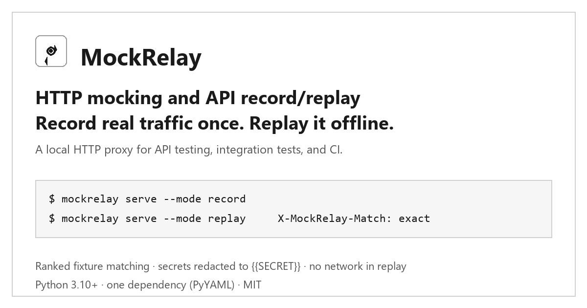
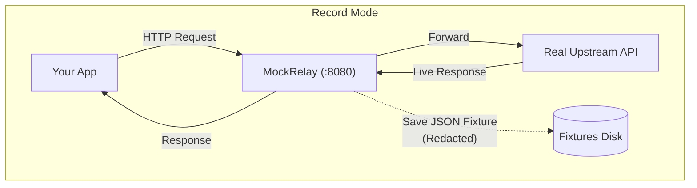
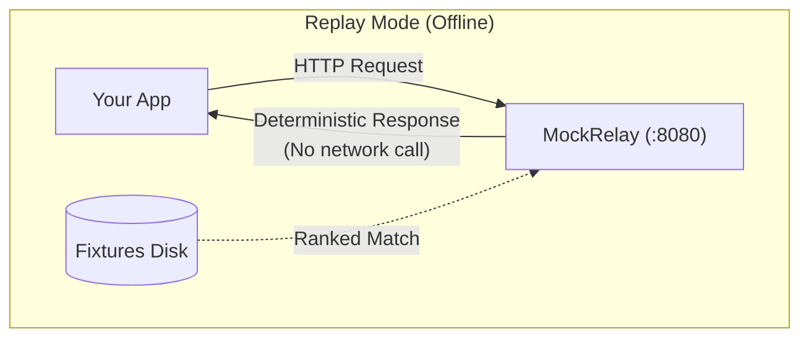

# MockRelay

<p align="center">
  
</p>

<p align="center">
  <a href="https://github.com/sswivell/mock-relay/actions/workflows/ci.yml"></a>
  <a href="https://sswivell.github.io/mock-relay/"></a>
  
  
  <a href="LICENSE"></a>
</p>

<p align="center">
  <b>Record a real API once. Replay it locally whenever you want.</b>
</p>

<p align="center">
  A local HTTP mock server and recording proxy for API testing, local development, and CI.
</p>

---

## The problem

You are writing code against somebody else's API. Maybe it is Stripe, maybe an
internal service owned by another team, maybe your own backend that is not
deployed yet. You want to develop against it and test against it without it
being slow, flaky, rate-limited, or down.

The usual answers are all awkward:

- **Call the real API in tests.** Slow, flaky, non-deterministic, and it burns
  someone else's quota on every CI run.
- **Hand-write a mock server.** Every new endpoint means more code to write,
  and the mock drifts from what the API actually returns.
- **Use a shared sandbox.** It is someone else's uptime and someone else's
  rate limit, and the sandbox environment does not match production.

## What MockRelay does

MockRelay is a local HTTP proxy that sits between your application and the
upstream API. You point your app at `http://localhost:8080/<upstream>/...`
instead of the real URL.

**In `record` mode** it forwards the request to the real service and writes
each request/response pair to a plain JSON file on disk, with secrets redacted.
**In `replay` mode** it answers those requests from those files and never
touches the network.

The fixtures are ordinary JSON in a directory you control, so they diff
cleanly, they can be committed next to your tests, and the same bytes come back
on every run.

```text
RECORD                                  REPLAY
──────                                  ──────
your app ──▶ MockRelay ──▶ real API     your app ──▶ MockRelay ──▶ JSON fixture
                  │                                         (no network)
                  └──▶ fixtures/<upstream>/*.json
```

## Who it is for

| If you are… | MockRelay helps with |
|---|---|
| A frontend or mobile developer | Building against a real API shape without running the backend |
| Writing integration or contract tests | Deterministic HTTP fixtures instead of live network calls |
| Setting up CI | Running the same suite offline, with no third-party rate limit |
| Reproducing a bug | Replaying the exact response that triggered it, including `429` and `500` |
| Testing retry and backoff | Injecting latency and errors into an otherwise happy path |
| On a plane, a train, or behind an outage | A local replica of your external API surface |

## When MockRelay is the wrong tool

Being straight about this saves you an afternoon:

- **You need to synthesize responses that never happened.** MockRelay replays
  traffic it recorded. Use WireMock, Prism, or hand-written route handlers for
  open-ended contract mocking.
- **You need per-test dynamic behavior** such as "return a random 500 half the
  time" generated at runtime. MockRelay replays fixed recordings.
- **You need mocking inside a single test process**, without running a server.
  Look at `responses`, `respx`, or `vcrpy` — they patch at the client layer.
- **You need a browser-level recording of someone else's site.** That is
  mitmproxy or a browser devtools HAR, and you would replay the HAR yourself.

MockRelay is the narrow thing it is: a local HTTP proxy that records real
traffic and replays it deterministically, with ranked fixture matching.

## Why use it?

- **Frontend & mobile development:** Build against stable, realistic backend responses without having to run full backend stacks or wait for unreleased APIs.
- **Integration testing & CI:** Run test suites offline in CI quickly and reliably without burning through third-party API rate limits.
- **Offline development:** Keep developing on planes, trains, or during ISP outages with fully functional local replicas of external APIs.
- **Reproducing tricky API responses:** Capture specific edge cases, error states (e.g. `429`, `500`), or latency spikes and replay them on demand.
- **Deterministic development:** Fixtures are stored as plain JSON files in `./fixtures/<upstream>/`. Commit them to git alongside your test suite for reproducible behavior across teams.
- **Zero unnecessary live API calls:** Avoid consuming third-party API quotas, test account costs, or triggering unwanted side effects on real servers.
- **Safe version control:** Request and response headers and bodies pass through an automated redaction pipeline. Sensitive tokens, credentials, and API keys are stored as `{{SECRET}}`.
- **Ranked smart matching:** Candidates are ranked by specificity (`exact` > `wildcard` > `regex` > `fuzzy`) so `/users/42` always beats `/users/*`, regardless of file order on disk.

---

## Core Concept





---

## Quickstart

The whole loop is four commands: install, record once, replay forever.

### 1. Install

Requires Python 3.10+ and has a single runtime dependency (PyYAML):

```bash
pip install "mockrelay @ git+https://github.com/sswivell/mock-relay.git"
```

This installs the CLI as `mockrelay`. A local checkout works too:

```bash
git clone https://github.com/sswivell/mock-relay.git
cd mock-relay
pip install -e .
```

Or run it in Docker, with no Python on the host at all:

```bash
docker build -t mockrelay .
docker run --rm -v "$PWD:/work" -p 8080:8080 -p 8081:8081 mockrelay serve --mode replay
```

> **Note on PyPI:** MockRelay is not published on PyPI yet. The install command
> above is the supported one and resolves the same tagged source the release
> workflow builds. Once a release is published, `pip install mockrelay` will
> work unchanged.

### 2. Initialize configuration

Generate a default `mockrelay.yaml` in your project root:

```bash
mockrelay init
```

### 3. Record traffic

Start MockRelay in record mode:

```bash
mockrelay serve --mode record
```

Send a request through the proxy:

```bash
curl http://localhost:8080/gh/users/octocat
```

MockRelay proxies the request to `https://api.github.com/users/octocat` and records the response to `fixtures/gh/`.

Point your application at the proxy instead of the real API and drive it as
usual; every request it makes gets recorded.

### 4. Replay traffic offline

Stop the server, switch MockRelay to replay mode, and pull the plug on the
network if you like:

```bash
mockrelay serve --mode replay --latency 50
```

Run the same request again:

```bash
curl -i http://localhost:8080/gh/users/octocat
```

```http
HTTP/1.1 200 OK
X-MockRelay-Match: exact
X-MockRelay-Fixture: gh-get-016c60e26e39
X-MockRelay-Score: 4000009
```

The response came from `fixtures/gh/gh-get-016c60e26e39.json` without touching
GitHub or any other network service. Run your test suite the same way.

Runnable versions of the whole walkthrough are in
[`examples/`](examples/) — including
[`record_and_replay.py`](examples/record_and_replay.py), which scripts the
record/replay switch step by step.

---

## How Proxying Works

MockRelay maps path prefixes to configured upstream targets:

```text
http://localhost:8080/<upstream-key>/<endpoint-path>
```

| Local Proxy Request | Upstream | Forwarded Target |
|---|---|---|
| `http://localhost:8080/gh/users/octocat` | `gh` | `https://api.github.com/users/octocat` |
| `http://localhost:8080/stripe/v1/customers` | `stripe` | `https://api.stripe.com/v1/customers` |
| `http://localhost:8080/local/v1/items` | `local` | `http://localhost:9000/v1/items` |

---

## Operating Modes

| Mode | Behavior |
|---|---|
| `record` | Forward all requests upstream and save each request/response as a fixture |
| `replay` | Serve from local fixtures only; never touches the network |
| `passthrough` | Forward all requests upstream without recording fixtures |
| `hybrid` | Serve from matching fixtures if found; otherwise forward upstream and record |

The mode for a request is resolved from the config, with the most specific
setting winning:

```text
Per-Route Override  >  Per-Upstream Setting  >  Global Setting
```

```yaml
mode: replay                 # global default

upstreams:
  stripe:
    base_url: "https://api.stripe.com"
    mode: passthrough        # everything under this upstream
    routes:
      "/v1/charges":
        mode: record         # except this path prefix
```

A running server's mode can be flipped without a restart:

```bash
curl -X POST http://127.0.0.1:8081/api/mode/hybrid
```

---

## Ranked Smart Matching

Most API mock tools check fixtures in directory order and return the first one whose path matches. This causes subtle bugs when broad wildcard routes inadvertently shadow specific fixtures.

MockRelay scores and ranks every candidate fixture by specificity:

1. **Path Strategy:** `exact` > `wildcard` > `regex` > `fuzzy`
2. **Body Constraints:** More constrained keys and operators score higher
3. **Query Constraints:** More constrained query parameters score higher
4. **Literal Density:** Patterns with more non-wildcard characters score higher

### Path Strategies

| Strategy | Pattern Example | Matches |
|---|---|---|
| exact | `/users/7` | Only `/users/7` |
| wildcard | `wildcard:/users/*` | Any single segment: `/users/7`, `/users/ada` |
| glob | `wildcard:/files/**` | Multiple segments: `/files/2026/09/report.pdf` |
| regex | `re:^/orders/\d+$` | Pattern match for numeric order IDs |
| fuzzy | `fuzzy:/customer/profile` | Tolerates minor typos above the threshold |

### JSON Body Matching with Operators

Match JSON request bodies using comparison operators and JSONPath-style keys:

```json
"body_contains": {
  "status": "paid",
  "total": { "$gt": 100 },
  "$.items[*].sku": "wildcard:A*"
}
```

Supported operators: `$eq`, `$ne`, `$gt`, `$gte`, `$lt`, `$lte`, `$in`, `$nin`, `$exists`, `$regex`, `$contains`.

### Configurable Match Priority

`match_priority` lets you reorder matching criteria globally, per upstream, or per route. If query parameters identify your resource better than the path, prioritize `query`:

```yaml
match_priority: [query, path, body, literal]   # default is [path, body, query, literal]
```

A fixture can also specify an integer `priority` to outrank other candidates:

```json
"match": {
  "method": "GET",
  "path": "wildcard:/files/**",
  "priority": 10
}
```

### Preview Matches from the CLI

Test how a request matches against stored fixtures without running a server:

```bash
mockrelay match /orders -m POST -b '{"total": 500}'
```

Outputs candidate ranking, scores, and a per-check breakdown of HTTP method, path, query parameters, and body.

### Sequential Replay

For endpoints that return a different response each time you call them, set
`sequential: true` and give each fixture an ascending `call_index`. Candidates
are then cycled in `call_index` order, wrapping when the last one is reached,
instead of being ranked:

```yaml
sequential: true
```

```json
{ "id": "step-0", "call_index": 0, "match": { "method": "GET", "path": "/v1/step" } }
{ "id": "step-1", "call_index": 1, "match": { "method": "GET", "path": "/v1/step" } }
{ "id": "step-2", "call_index": 2, "match": { "method": "GET", "path": "/v1/step" } }
```

Seven calls to that path return `step-0`, `step-1`, `step-2`, `step-0`, …

Two things to know:

- `match_priority` and per-fixture `priority` do not apply while sequential is
  on. Ordering is purely `call_index`.
- The recorder does **not** build this for you. Fixture identity is derived from
  the request, so recording the same endpoint three times overwrites one file
  rather than producing three. Write the fixtures, or use a hand-written
  `priority` per response when the steps are distinguishable by query or body
  rather than being a blind sequence.

---

## CLI Reference

```bash
# Start proxy server
mockrelay serve
mockrelay serve --mode replay --latency 150

# Mode shortcuts
mockrelay record
mockrelay replay --latency 50

# Inspect and match fixtures
mockrelay list
mockrelay match /users/7
mockrelay stats

# Validate configuration and fixtures (exits 4 on error for CI pipelines)
mockrelay validate

# Clean fixtures older than N days (preview by default; add --yes to prune)
mockrelay clean --older-than 30
mockrelay clean --older-than 30 --yes

# Configuration management
mockrelay init
mockrelay init --force
mockrelay config
mockrelay --version
```

Commands accept `--json` for machine-readable output in scripts and CI pipelines.

---

## Using MockRelay in CI

Fixtures are plain files in your repository, so a CI job needs no network and
no credentials. Start the proxy in replay mode, run your tests against it, then
gate the job on `mockrelay validate`:

```yaml
# .github/workflows/integration.yml
- run: pip install "mockrelay @ git+https://github.com/sswivell/mock-relay.git"
- run: mockrelay validate            # exits 4 if the config or a fixture is broken
- run: mockrelay replay --latency 0 &
- run: pytest tests/integration -q
```

If a fixture ever gets hand-edited into an invalid shape, the job fails on the
`validate` step with the file and the reason, instead of failing later with an
obscure 501 in the middle of the suite.

---

## How MockRelay compares

There are a lot of HTTP mocking tools. This is the honest short version of
where MockRelay sits among the ones people actually reach for.

| Tool | Shape | Where it fits |
|---|---|---|
| **MockRelay** | Local proxy, records real traffic to JSON fixtures, replays offline with ranked matching | Development and integration tests against real API shapes |
| `vcrpy` | Library that patches your HTTP client | Per-test recording inside a single process |
| `responses` / `respx` | Library that stubs one client's responses | Unit tests that need a canned response, no server |
| WireMock / Prism | Standalone mock server you configure by hand | Contract mocking for responses you invent |
| Hoverfly | Go proxy with a rules DSL and simulation | Service virtualization with a richer rule language |
| mitmproxy | Interactive proxy, flow-based | Debugging and inspecting traffic from any client |

MockRelay's specific combination is: real recorded traffic as the source of
truth, plain JSON on disk, ranked matching rather than first-match-wins, and no
service to deploy.

---

## Documentation

Full documentation is available at [https://sswivell.github.io/mock-relay/](https://sswivell.github.io/mock-relay/):

- [Getting Started](docs/getting-started.md) — the full walkthrough
- [CLI Reference](docs/cli.md) — every command and flag
- [Smart Matching Reference](docs/matching.md) — strategies, operators, debugging a miss
- [Configuration Reference](docs/configuration.md) — every key, with defaults
- [Fixtures & Redaction](docs/fixtures.md) — the schema and secret masking
- [Operating Modes](docs/modes.md) — record, replay, passthrough, hybrid
- [Common Recipes](docs/recipes.md) — SDK redirection, retry testing, CI gating
- [Comparisons](docs/comparisons.md) — where this fits against `vcrpy`, WireMock, mitmproxy, and the rest
- [Admin API & Web UI](docs/admin.md) — the dashboard and JSON endpoints
- [Architecture & Internals](docs/architecture.md) — how a request flows through the code
- [Development Guide](docs/development.md) — local setup, tests, and linting
- [Demo Script](docs/demo.md) — a scripted end-to-end demo
- [Examples](examples/) — runnable scripts and a demo config

---

## Contributing

Contributions are welcome. The fastest way in is to pick up an issue labelled
[`good first issue`](https://github.com/sswivell/mock-relay/labels/good%20first%20issue).

- [CONTRIBUTING.md](CONTRIBUTING.md) — local setup, testing, and codebase architecture
- [ROADMAP.md](ROADMAP.md) — planned features and roadmap themes
- [CODE_OF_CONDUCT.md](CODE_OF_CONDUCT.md)
- [GitHub Discussions](https://github.com/sswivell/mock-relay/discussions) — questions, ideas, and feedback

To run the test suite locally:

```bash
pytest -q
ruff check .
```

---

## License

MockRelay is open source software licensed under the [MIT License](LICENSE).
